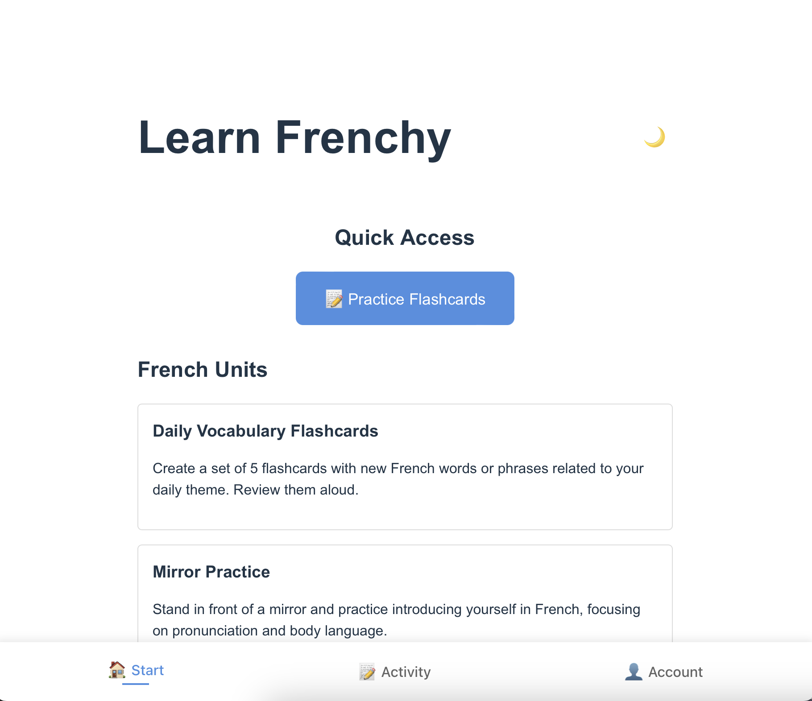
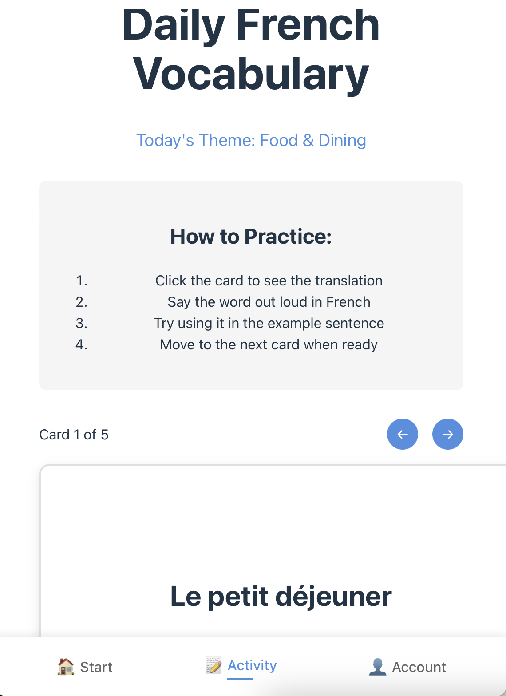

# Learn Frenchy French 🇫🇷

Learn Frenchy French is a simple and interactive web application designed to help users learn French through various activities, including flashcards and unit details. 

## Features 🌟

- **Interactive UI**: Toggle between light and dark modes. 🌞🌜
- **Quick Access**: Easily navigate to flashcard practice. 📝
- **Unit Details**: View detailed information about different learning units. 📚

## Installation ⚙️

To run Learn Frenchy locally, follow these steps:

1. **Clone the Repository**:
git clone https://github.com/quarocx/learn-frenchy-french.git
cd learn-frenchy
text

2. **Install Dependencies**:
Make sure you have [Node.js](https://nodejs.org/) installed. Then run:
npm install
text

3. **Run the Application**:
Start the development server:
npm run dev
Open your browser and go to `http://localhost:3000` to see the app in action. 🚀
(Tip: Be aware that you also need to start the backend)

## Usage 🖥️

- Click on the **Practice Flashcards** button to start learning. 🎓
- Select a unit to view its details. 🔍
- Use the navigation bar to switch between views. 📊
